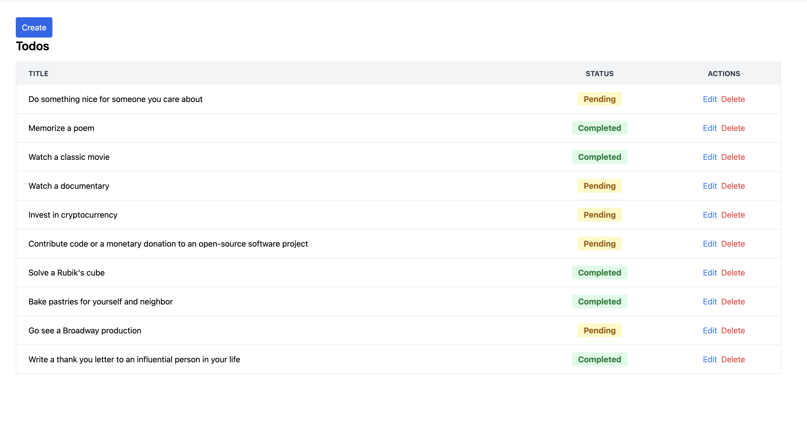

# Todo App in React with Vite

This is a simple Todo application built using React and Vite, styled with Tailwind CSS. The application allows users to create, view, edit, and delete todo items.



## Features

- **Add Todos**: Create new tasks with a title and description.
- **Edit Todos**: Modify existing tasks.
- **Delete Todos**: Remove tasks from the list.
- **Status Management**: View task statuses as "Pending," "In Progress," or "Completed."
- **Responsive UI**: Designed with Tailwind CSS to be responsive and user-friendly.

## Tech Stack

- **React**: UI library for building the user interface.
- **Vite**: Fast build tool and development server with Hot Module Replacement (HMR).
- **Tailwind CSS**: Utility-first CSS framework for styling.
- **ESLint**: Linting to maintain code quality and consistency.

## Installation

1. **Clone the repository**:
   ```bash 
   https://github.com/hameed-fu/todo-app-react-vite
   cd todo-app-react-vite
